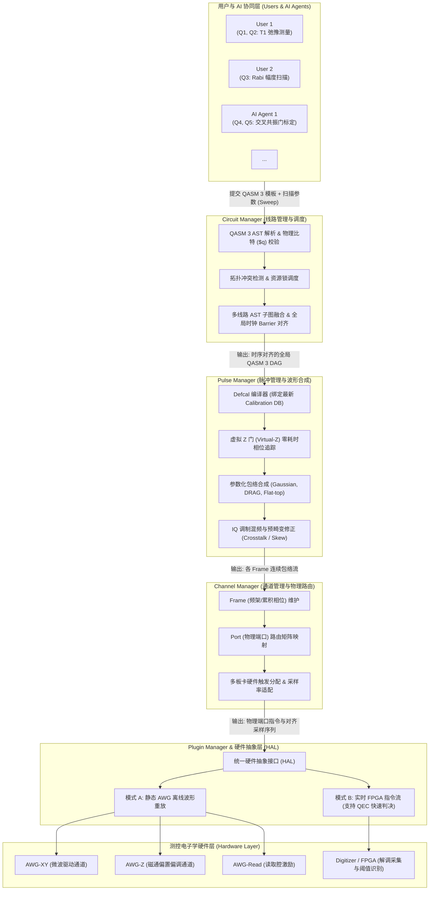

# SQController

**SQController** 是一套面向百比特级超导量子芯片的现代测控软件系统，覆盖核心场景：
- **参数校准 (Qubit Calibration)**：如 T1, T2*, Rabi 振荡, Ramsey 演化, AllXY, DRAG 系数标定等。
- **基准性能表征 (Qubit Benchmarking)**：单双比特 Randomized Benchmarking (RB), 交叉共振门 (CR) 标定, 读出保真度评测等。
- **量子纠错线路 (QEC Circuits)**：多比特表面码 (Surface Code) 校验元测量、实时错误综合征提取与主动复位 (Active Reset)。
- **量子算法线路 (Quantum Algorithms)**：通用参数化量子线路与任意门序列执行。

---

## 🌟 核心设计理念与特征

- 📐 **基于 OpenQASM 3 的全栈标准化线路规范 (OpenQASM 3 Alignment)**
  - 全面基于 **OpenQASM 3** 构建系统的中间表示（IR）与交互接口。
  - **纳秒级精确时序**：原生利用 QASM 3 的 `delay[t]`, `barrier`, `stretch` 语义，精确表征退相干时间、回旋解耦序列及多比特门同步。
  - **脉冲层无缝绑定 (`defcal`)**：通过 OpenQASM 3 的校准语法（`defcal`），建立从高级逻辑门到物理脉冲包络的标准映射，彻底告别底层私有波形配置。
  - **经典控制流与实时反馈**：原生支持 `if (c == 1)`、`reset` 等控制语义，为 QEC 快速判决与 Active Reset 提供完备语言支撑。
  - **测量实验参数扫描模型 (Parameter Sweep)**：针对物理标定场景，提供「QASM 3 线路模板 + 参数扫描向量 (Sweep Vector)」的高层封装，统一离散实验与批量计算。

- 🔀 **多比特并行与多用户协同 (Multi-Qubit Parallelism & Concurrency)**
  - 针对中大规模（百比特级）超导芯片，构建基于 QASM 3 AST / DAG 的图调度引擎。
  - 支持多实验人员、多 AI Agent 分工协作，自动完成芯片拓扑分析与空间无冲突子图识别，实现多任务在线并行流水线测量。

- 🤖 **AI 原生架构 (AI-Native & Agentic Measurement)**
  - 原生提供标准 **MCP (Model Context Protocol)** 协议服务端与统一 CLI，方便大语言模型 Agent 接入。
  - 大模型直接生成、校验与调度标准化 QASM 3 线路，无需适配私有 API，赋能全自主探索、自适应闭环校准与故障自动诊断。

- 🔌 **软硬件全面解耦与 Frame/Port 物理抽象 (Hardware-Software Decoupling)**
  - 测控底层不锁定特定仪器品牌，通过统一的硬件抽象层（HAL）与插件机制（Plugin Manager）对接不同厂商的电子学设备。
  - 引入 **Frame（时序频架）** 与 **Port（物理端口）** 概念：Frame 负责跟踪频率与动态虚拟 Z 门相位，Port 负责实际仪器端口路由与多板卡触发同步。

---

## 🏛️ 系统架构 (Architecture)

SQController 采用分层解耦的流水线式架构，从高层 QASM 3 量子线路逐步编译、降阶并映射到物理仪器：



### 核心模块职责深度解析

1. **Circuit Manager（线路管理器）**
   - **输入**：多用户 / AI 并发提交的 OpenQASM 3 门序列或带占位符的参数化模板（+ 扫描向量）。
   - **核心机制**：
     - **AST 语法与拓扑校验**：严格校验物理比特（`$0`, `$1` ...）与芯片连接拓扑，拒绝非法耦合操作。
     - **空间无冲突调度**：通过物理比特锁、读出线/波导互斥锁分析依赖，实现并发任务的流水线排队。
     - **QASM 3 子图融合 (DAG Stitcher)**：将相互独立的无冲突子线路缝合为一个执行周期的全局 AST，并插入精确的全局同步 `barrier`。
   - **输出**：时空调度完成、无资源冲突的全局 QASM 3 物理执行流。

2. **Pulse Manager（脉冲管理器）**
   - **输入**：调度对齐后的门序列。
   - **核心机制**：
     - **`defcal` 规范动态展开**：查询最新校准参数数据库（Calibration DB），将抽象门（如 `x $0`, `cx $0, $1`）按照标定好的物理参数（频率、幅度、包络类型、DRAG 系数等）展开为底层脉冲。
     - **Virtual-Z 门消除**：对所有 $R_z(\theta)$ 门进行编译器优化，直接更新后续脉冲的参考系相位，实现物理耗时为 0 的纯虚拟旋转。
     - **波形预畸变与调制**：计算 IQ 正交混频调制，进行脉冲反卷积、通道时延校准（Skew）与通道间串扰矩阵补偿。
   - **输出**：关联到逻辑 Frame 的连续时域脉冲序列（Pulse Envelopes）。

3. **Channel Manager（通道管理器）**
   - **输入**：Pulse Manager 输出的脉冲与时序指令。
   - **核心机制**：
     - **Frame 到 Port 路由**：维护高层 Frame（定义频率与初始相位）到物理 Port（具体板卡端口）的映射矩阵。
     - **采样率自适应与波形重采样**：自动适配不同设备（如 2.5GSa/s AWG 与 1GSa/s AWG）的采样率插值计算。
     - **同步与标记分配**：分配主从板卡触发源、对齐标记（Marker）与读出采集门控（Readout Gate Window）。
   - **输出**：面向各个独立硬件端口的标准化波形矩阵与控制指令。

4. **Plugin Manager（插件管理器与硬件抽象层 HAL）**
   - **输入**：标准化通道指令集与采样数据。
   - **核心机制**：
     - 提供厂商中立的统一接口，支持不同厂商（如 Zurich Instruments, Qblox, Keysight, Quantum Machines 以及自研 FPGA 板卡）的驱动热插拔。
     - **双模执行支撑**：
       - **静态波形模式**：面向传统 AWG + 采集卡，将完整实验展开为波形段并批量上传播放。
       - **动态实时控制模式**：面向支持板载快速判决的 FPGA 系统，直通 QASM 3 条件分支（QEC 校验元快速前馈）。
   - **输出**：驱动硬件执行物理微波与采集操作，返回数字解调 IQ 点或分类结果。

---

## 🔬 实验测量示例 (OpenQASM 3 范式)

在 SQController 中，一个基础物理测量（如 $T_1$ 弛豫测量）被描述为一个参数化 QASM 3 模板与扫描向量：

```python
# 1. 定义实验线路模板 (QASM 3 范式)
qasm3_template = """
OPENQASM 3.0;
include "stdgates.inc";

// 物理比特与测量寄存器
bit c;
x $0;                 // 激发到 |1> 态
delay[tau] $0;        // 扫描变量 tau
measure $0 -> c;      // 色散读出
"""

# 2. 构造实验扫参任务提交给 Circuit Manager
experiment = SweepExperiment(
    template=qasm3_template,
    sweep_params={"tau": np.linspace(100e-9, 100e-6, 50)}, # 100ns 到 100us
    shots=2000
)
```

---

## 🛠️ 项目管理与开发环境 (Development)

本项目使用现代 Python 包管理器 **[uv](https://github.com/astral-sh/uv)** 进行依赖与虚拟环境管理。

```powershell
# 1. 克隆代码库后同步环境
uv sync

# 2. 运行开发脚本 / 主程序
uv run python main.py

# 3. 添加依赖包
uv add openqasm3 pydantic numpy scipy
uv add --dev pytest ruff
```

---

## 🗺️ 后续迭代规划 (Roadmap)

- [ ] **Phase 1: OpenQASM 3 AST 与核心数据模型 (Core IR & Data Models)**
  - 引入并适配 `openqasm3` AST，建立规范的内部中间表示 (IR)。
  - 定义物理映射数据结构：`PhysicalQubit` (`$0`..`$N`)、`Frame`、`Port` 与 `CalibrationParameters`。
  - 定义标定实验容器模型 `SweepExperiment`（QASM 3 模板 + 参数扫描字典）。
- [ ] **Phase 2: `defcal` 编译引擎与脉冲通道路由 (Pulse & Frame Engine)**
  - 实现基于 `defcal` 语法的脉冲编译器，完成抽象门到高斯、DRAG、Flat-top 包络的展开。
  - 实现 Virtual-Z 门零耗时相位追踪器与 IQ 混频调制计算。
  - 实现 `Frame -> Port` 路由矩阵与多通道波形重采样。
- [ ] **Phase 3: 硬件抽象层与 QASM 3 时序仿真器 (HAL & Timing Inspector)**
  - 定义统一的 `BaseInstrumentPlugin` 硬件驱动抽象基类，规范静态重放与动态指令流两套接口。
  - 实现基于虚拟波形模拟器的 Dummy 驱动插件。
  - 实现 **QASM 3 时序可视化器 (Timing Inspector)**，导出各端口纳秒级物理脉冲时序波形图。
- [ ] **Phase 4: 多比特资源锁调度器与 AST 融合 (Circuit Scheduler & Stitcher)**
  - 实现基于芯片拓扑冲突与物理资源锁（比特、读出线）的优先级排队调度算法。
  - 实现 **QASM 3 子图融合器 (Circuit Stitcher)**，自动将并发无冲突子任务合并为单个全局 QASM 3 执行块并插入同步 `barrier`。
- [ ] **Phase 5: AI 原生接口与自动化闭环校准 (MCP Server & Agentic Loop)**
  - 构建标准 MCP 服务端，暴露 `validate_qasm3`、`visualize_schedule`、`run_sweep_experiment`、`query_calibration` 等工具接口。
  - 实现大模型驱动的自适应闭环校准工作流（自动下发 QASM3 实验 -> 读取 IQ -> 曲线拟合 -> 自动更新 Calibration DB）。
